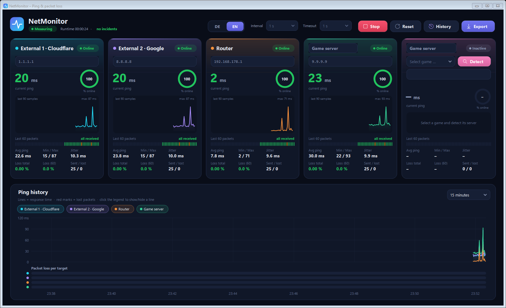
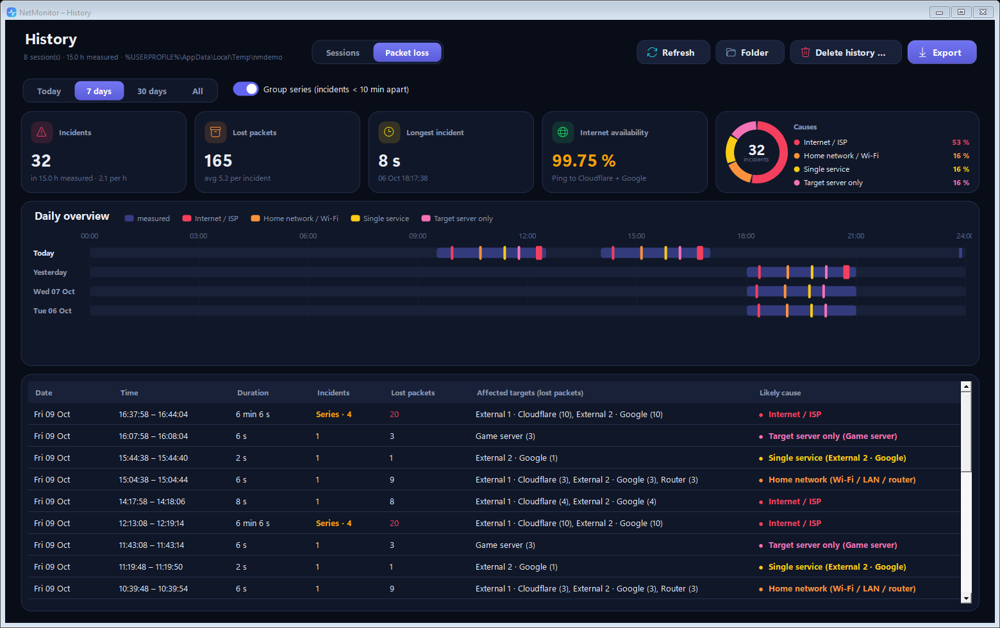
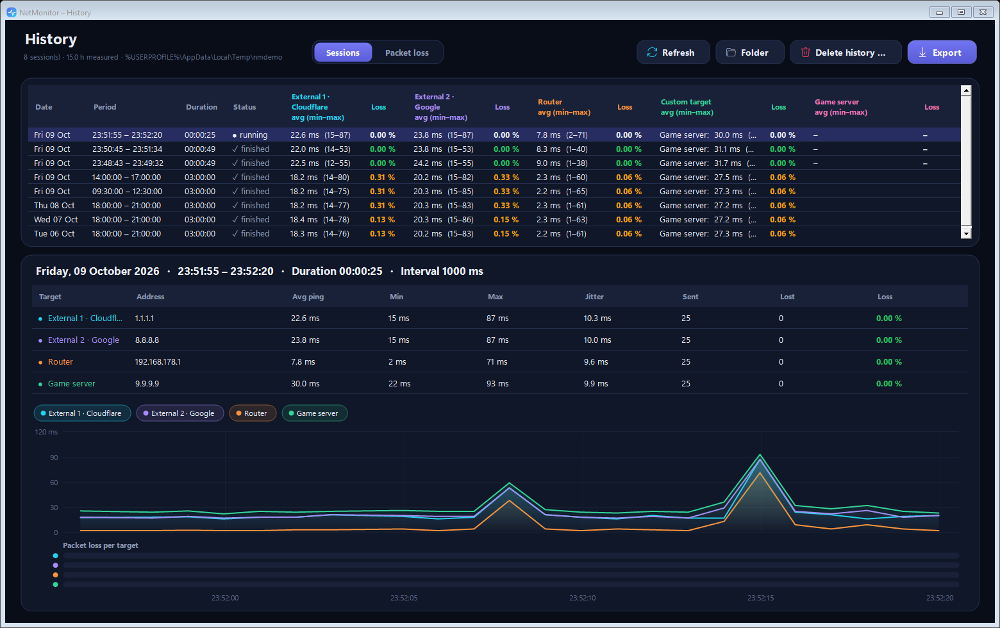

# NetMonitor

**Continuous ping & packet-loss monitor for Windows** – watch your internet connection, your router and your game server side by side, and find out *where* packet loss really happens.



> 🇩🇪 Deutsche Kurzfassung weiter unten – die App selbst ist komplett auf Deutsch und Englisch umschaltbar.

## Features

- **Five targets at once** – two independent public resolvers (Cloudflare `1.1.1.1`, Google `8.8.8.8`), your **router** (gateway is detected automatically), a freely named **custom target** and a **game server**.
- **Live dashboard** – current ping, availability ring, sparkline of the last 90 samples, the last 60 packets as a colour strip, avg / min / max / jitter / loss.
- **Ping history chart** with hover tooltip, toggleable lines and a per-target **packet-loss lane**.
- **Game server detection** – pick a running game, click *Detect* during a match: NetMonitor watches the game's network traffic for 12 s (Windows ETW, administrator rights once via UAC) and suggests the most likely game server. If the server blocks ping, the last reachable router in front of it is measured instead. Read-only, no injection – safe with anti-cheat.
- **History** – every scan (start → stop) is saved automatically and can be reviewed, exported or deleted.
- **Packet-loss analysis** – incidents are grouped, shown on a daily timeline and classified by their **likely cause**:

  | Lost packets at … | Likely cause |
  |---|---|
  | router (and usually everything else) | 🟠 Home network – Wi-Fi / LAN / router |
  | both external targets, router fine | 🔴 Internet / ISP |
  | only one external target | 🟡 Single service |
  | only the custom / game server | 🩷 Target server only |

  Incidents less than 10 minutes apart can be grouped into a *series*.
- **CSV export** (+ PNG of the chart) for sessions and incident lists.
- **English / German** – switch live in the header, including number and date formats.
- **Dark UI**, hand-drawn controls, high-DPI aware.




## Installation

1. Download `NetMonitor-<version>.zip` from the [Releases](../../releases) page.
2. *Recommended:* right-click the ZIP → **Properties** → tick **Unblock** → OK.
3. Extract it and double-click **`Setup.cmd`**.
4. Choose language, folder and shortcuts → **Install**.

The installer works **per user without administrator rights**: files go to `%LOCALAPPDATA%\Programs\NetMonitor`, shortcuts to the Start menu / desktop, and NetMonitor appears in **Settings → Apps → Installed apps**, where it can be uninstalled again. Running `Setup.cmd` from a newer release updates an existing installation; history and settings are kept.

> **Why is there no `.exe`?** NetMonitor ships as source code that the built-in Windows PowerShell compiles at start-up (takes ~2 s). This way it also runs on PCs with **Smart App Control**, which blocks unsigned executables. Windows may still show *“Windows protected your PC”* for `Setup.cmd` from the internet – click **More info → Run anyway**, or unblock the ZIP first (step 2).

**Portable mode:** instead of installing, simply double-click `NetMonitor.cmd` in the extracted folder.

### Requirements

- Windows 10 or 11 (64-bit)
- Windows PowerShell 5.1 and .NET Framework 4.x – both are part of Windows

## Usage

| | |
|---|---|
| **Start / Stop** | starts a scan; each scan becomes a session in the history |
| **Interval / Timeout** | ping interval (0.5–5 s) and timeout per ping |
| **Custom target** | enter any name and IP / host name, e.g. a game server you know |
| **Game server** | select the running game → **Detect** while in a match → confirm the suggested server |
| **History** | sessions with details and chart; tab **Packet loss** for the incident analysis |
| **Delete history …** | delete the selected session, everything older than 7 / 30 days, or all |

Data is stored in `%APPDATA%\NetMonitor` (`Verlauf\*.summary` + `*.samples`, `settings.txt`). Set the environment variable `NETMONITOR_HOME` to use a different folder (e.g. for a portable setup).

> Many game servers do not answer ping (ICMP blocked). NetMonitor then measures the last router in front of the server, which reflects your connection to the data centre. Routers deprioritise ping replies, so occasional single losses on that target are less meaningful than losses on the external targets.

## Building a release

```powershell
powershell -ExecutionPolicy Bypass -File build\Build-Release.ps1
```

Compiles all sources as a check and creates `dist\NetMonitor-<version>.zip`. The version is defined in `src/Core.cs` (`Program.Version`).

## Project structure

```
NetMonitor.ps1        launcher – compiles src\*.cs and starts the app / setup / uninstaller
NetMonitor.cmd        start without installing
Setup.cmd             installer
src\Core.cs           data, storage, loss analysis, game server detection (ETW)
src\Controls.cs       theme and custom-drawn controls (charts, timeline, buttons …)
src\MainForm.cs       dashboard
src\HistoryForm.cs    history, packet-loss analysis, dialogs
src\Setup.cs          installer / uninstaller
src\Strings.cs        German / English
build\                release script
```

## License

[MIT](LICENSE)

---

## 🇩🇪 Deutsch – Kurzfassung

**NetMonitor** misst dauerhaft Ping und Paketverluste zu zwei Internet-Diensten (Cloudflare, Google), deinem **Router**, einem frei benennbaren Ziel und deinem **Spielserver** – und zeigt dir, *wo* Paketverluste entstehen: im Heimnetz, beim Provider, bei einem einzelnen Dienst oder nur beim Spielserver.

**Installation:** ZIP von der Releases-Seite laden → (empfohlen) Rechtsklick → Eigenschaften → „Zulassen“ → entpacken → **`Setup.cmd`** doppelklicken. Installiert wird ohne Adminrechte für dein Benutzerkonto, inklusive Startmenü-Eintrag und Deinstallation über *Einstellungen → Apps*. Erscheint „Der Computer wurde durch Windows geschützt“: **Weitere Informationen → Trotzdem ausführen**.

**Highlights:** Live-Dashboard mit Sparklines und Paketleiste · Verlauf aller Messungen · Paketverlust-Analyse mit Tagesübersicht, Ursachen-Einschätzung und Serien-Zusammenfassung · automatische Spielserver-Erkennung · CSV-Export · Umschaltung Deutsch/Englisch im Kopfbereich.

Die Messdaten liegen unter `%APPDATA%\NetMonitor`.
