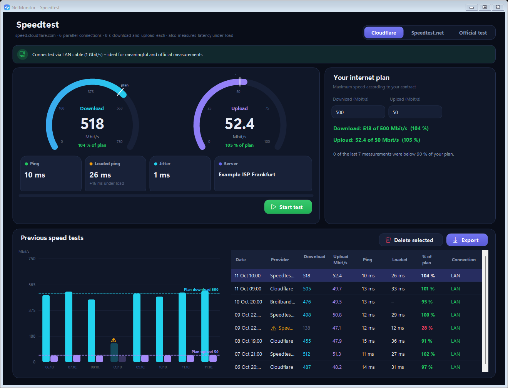

# NetMonitor

**Continuous ping, packet-loss and speed monitor for Windows** – watch your internet connection, your router and your game server side by side, find out *where* packet loss really happens and check whether you get the speed you pay for.


> 🇩🇪 Deutsche Kurzfassung [weiter unten](#-deutsch--kurzfassung) – die App selbst ist komplett auf Deutsch und Englisch umschaltbar.

## Highlights

- 📡 **Five targets in parallel** – Cloudflare, Google, your router, a custom target and your game server
- 🔍 **Packet-loss analysis** – incidents on a daily timeline with their **likely cause** (home network, ISP, single service, game server)
- 🎮 **Game server detection** – select the running game, NetMonitor finds the server it is talking to
- ⚡ **Speed test** – Cloudflare, Speedtest.net or the official regulator test, compared with your **contracted plan**
- 🔌 **LAN or Wi-Fi?** – connection type, Wi-Fi signal and LAN link speed at a glance
- 🗂️ **History** of every scan, CSV export, English / German, dark UI – no administrator rights needed

## Features

### Monitoring

- **Targets:** two independent public resolvers (Cloudflare `1.1.1.1`, Google `8.8.8.8`), your **router** (the gateway is detected automatically), a freely named **custom target** and a **game server**.
- **Live dashboard:** current ping, availability ring, sparkline of the last 90 samples, the last 60 packets as a colour strip, avg / min / max / jitter / loss per target.
- **Ping chart** with hover tooltip, toggleable lines and a **packet-loss lane** per target. Speed test periods are hatched in the chart.
- **Connection badge** in the header: *LAN · 1 Gbit/s* or *Wi-Fi · 87 %* (signal strength).

### Game server detection

Select a running game and click **Detect** during a match. NetMonitor watches the game's network traffic for 12 s (Windows ETW, administrator rights once via UAC) and suggests the most likely game server – steady UDP traffic in both directions. If the server blocks ping, the last reachable router in front of it is measured instead. Read-only, no injection – safe with anti-cheat software.

### History & packet-loss analysis

Every scan (start → stop) is saved automatically as a session and can be reviewed with details and chart, exported or deleted.

The **Packet loss** tab groups lost packets into incidents, shows them on a **daily timeline** and estimates the **likely cause**:

| Lost packets at … | Likely cause |
|---|---|
| router (and usually everything else) | 🟠 Home network – Wi-Fi / LAN / router |
| both external targets, router fine | 🔴 Internet / ISP |
| only one external target | 🟡 Single service |
| only the custom / game server | 🩷 Target server only |

Incidents less than 10 minutes apart can be grouped into a *series*. Packet loss during a speed test is not counted as an incident.


### Speed test

Manual speed test with three providers:

| Provider | How it works |
|---|---|
| **Cloudflare** | built in – 6 parallel connections, download / upload, ping, jitter and **latency under load** (bufferbloat) |
| **Speedtest.net** | via the official [Ookla Speedtest CLI](https://www.speedtest.net/apps/cli), with server selection. The installer – or one click in the app – downloads it directly from Ookla, verifies its SHA-256 checksum and stores it in `%APPDATA%\NetMonitor\tools\ookla`. |
| **Official test** | the regulator's own measurement where one exists: 🇩🇪 Germany (Bundesnetzagentur – *Breitbandmessung*, legally binding), 🇦🇹 Austria (RTR-Netztest), 🇨🇭 Switzerland (networktest.ch), 🇱🇺 Luxembourg (checkmynet.lu). NetMonitor opens it; the result can be entered for comparison. For other countries Cloudflare or Speedtest.net are fully sufficient. |

- **Contracted plan:** enter the speeds from your contract – gauges show a plan marker and *% of plan*, the history chart shows plan lines, and NetMonitor points out when results are repeatedly below 90 %.
- **Plausibility check:** if latency did not rise under load and the result is far below your plan or previous results, the connection was obviously not saturated. Such results are flagged ⚠ and excluded from the plan evaluation; Speedtest.net automatically repeats them against another nearby server.
- **Connection check:** a banner shows whether you are on LAN or Wi-Fi (with network name and signal), recommends a LAN cable for meaningful and official measurements, and warns if your LAN port is slower than your plan (e.g. a 100 Mbit/s link). Every result stores the connection type.



### More

- **CSV export** (plus a PNG of the chart) for live data, sessions, incident lists and speed tests
- **English / German** – switch live in the header, including number and date formats
- Dark, hand-drawn UI, high-DPI aware


## Installation

1. Download `NetMonitor-<version>.zip` from the [Releases](../../releases) page.
2. *Recommended:* right-click the ZIP → **Properties** → tick **Unblock** → OK.
3. Extract it and double-click **`Setup.cmd`**.
4. Choose language, folder and options → **Install**.

The installer works **per user without administrator rights**:

- files go to `%LOCALAPPDATA%\Programs\NetMonitor`
- optional Start menu entry and desktop shortcut
- optional download of the **Ookla Speedtest CLI** for Speedtest.net (by downloading you accept [Ookla's terms](https://www.speedtest.net/about/terms))
- NetMonitor appears in **Settings → Apps → Installed apps** and can be uninstalled there (optionally including history and settings)

**Updating:** run `Setup.cmd` from a newer release – the existing installation is detected and updated; history and settings are kept.

**Portable mode:** instead of installing, double-click `NetMonitor.cmd` in the extracted folder.

> **Why is there no `.exe`?** NetMonitor ships as source code that the built-in Windows PowerShell compiles at start-up (takes about 2 s). This way it also runs on PCs with **Smart App Control**, which blocks unsigned executables. Windows may still show *“Windows protected your PC”* for `Setup.cmd` from the internet – click **More info → Run anyway**, or unblock the ZIP first (step 2).

### Requirements

- Windows 10 or 11 (64-bit)
- Windows PowerShell 5.1 and .NET Framework 4.x – both are part of Windows
- Administrator rights only for the optional game server detection (one UAC prompt per detection)

## Usage

| | |
|---|---|
| **Start / Stop** | starts a scan; each scan becomes a session in the history |
| **Interval / Timeout** | ping interval (0.5–5 s) and timeout per ping |
| **DE / EN** | switches the language live |
| **Custom target** | enter any name and IP / host name, e.g. a server you know |
| **Game server** | select the running game → **Detect** while in a match → confirm the suggested server |
| **History** | sessions with details and chart; tab **Packet loss** for the incident analysis |
| **Speedtest** | choose the provider, enter your plan once, click **Start test** |
| **Delete history …** | delete the selected session, everything older than 7 / 30 days, or all |

### Tips

- **Measure via LAN cable** for meaningful speed tests – Wi-Fi often limits the result. Official measurements (e.g. the German *Breitbandmessung*) require a LAN connection.
- A full speed test saturates your connection for about 20 s and transfers several hundred MB at high speeds.
- Many game servers do not answer ping (ICMP blocked). NetMonitor then measures the last router in front of the server. Routers deprioritise ping replies, so occasional single losses on that target are less meaningful than losses on the external targets.

## Data & privacy

All data stays on your PC in `%APPDATA%\NetMonitor`:

| | |
|---|---|
| `Verlauf\*.summary`, `*.samples` | sessions and individual ping results |
| `speedtests.csv` | speed test results |
| `settings.txt` | targets, language, plan and other settings |
| `tools\ookla\` | Ookla Speedtest CLI (if downloaded) |

NetMonitor only contacts the targets you ping and – when you run a speed test – the chosen provider (Cloudflare or Ookla). Set the environment variable `NETMONITOR_HOME` to store data in a different folder (e.g. for a portable setup).

## Building a release

```powershell
powershell -ExecutionPolicy Bypass -File build\Build-Release.ps1
```

Compiles all sources as a check and creates `dist\NetMonitor-<version>.zip`. The version is defined in `src/Core.cs` (`Program.Version`).

## Project structure

```
NetMonitor.ps1        launcher – compiles src\*.cs and starts the app / setup / uninstaller
NetMonitor.cmd        start without installing (portable)
Setup.cmd             installer
src\Core.cs           data, storage, loss analysis, connection detection, game server detection (ETW)
src\Controls.cs       theme and custom-drawn controls (charts, timeline, buttons …)
src\MainForm.cs       dashboard
src\HistoryForm.cs    history, packet-loss analysis, dialogs
src\SpeedTest.cs      speed test (Cloudflare, Ookla CLI, official tests) and plan comparison
src\Setup.cs          installer / uninstaller
src\Strings.cs        German / English
build\                release script
docs\screenshots\     screenshots for this README
```

## License

NetMonitor is licensed under the [MIT License](LICENSE).

The Ookla Speedtest CLI is proprietary software by Ookla. It is **not** part of this repository – it is downloaded from Ookla only if you choose to and is subject to [Ookla's terms](https://www.speedtest.net/about/terms) and [privacy policy](https://www.speedtest.net/about/privacy).

---

## 🇩🇪 Deutsch – Kurzfassung

**NetMonitor** misst dauerhaft Ping und Paketverluste zu zwei Internet-Diensten (Cloudflare, Google), deinem **Router**, einem frei benennbaren Ziel und deinem **Spielserver** – und zeigt dir, *wo* Paketverluste entstehen: im Heimnetz, beim Provider, bei einem einzelnen Dienst oder nur beim Spielserver.

**Funktionen**
- Live-Dashboard mit Sparklines, Paketleiste und Verfügbarkeitsring
- Verlauf aller Messungen mit Paketverlust-Analyse: Tagesübersicht, Ursachen-Einschätzung, Serien-Zusammenfassung
- Automatische Spielserver-Erkennung (einmalig Adminrechte, Anti-Cheat-unbedenklich)
- Speedtest per **Cloudflare**, **Speedtest.net** (Ookla CLI, wird auf Wunsch automatisch geladen) oder **offizieller Messung** (Breitbandmessung der Bundesnetzagentur, RTR-Netztest, networktest.ch, checkmynet.lu)
- Vergleich mit deinem **gebuchten Tarif**, unplausible Messungen werden erkannt und markiert
- Anzeige **LAN oder WLAN** inkl. Signalstärke – offizielle Messungen bitte per LAN-Kabel
- CSV-Export, Umschaltung Deutsch/Englisch

**Installation:** ZIP von der Releases-Seite laden → (empfohlen) Rechtsklick → Eigenschaften → „Zulassen“ → entpacken → **`Setup.cmd`** doppelklicken. Installiert wird ohne Adminrechte für dein Benutzerkonto, inklusive Startmenü-Eintrag, optionalem Download der Ookla CLI und Deinstallation über *Einstellungen → Apps*. Erscheint „Der Computer wurde durch Windows geschützt“: **Weitere Informationen → Trotzdem ausführen**. Ein Update funktioniert genauso – Verlauf und Einstellungen bleiben erhalten.

Die Messdaten liegen unter `%APPDATA%\NetMonitor`.
